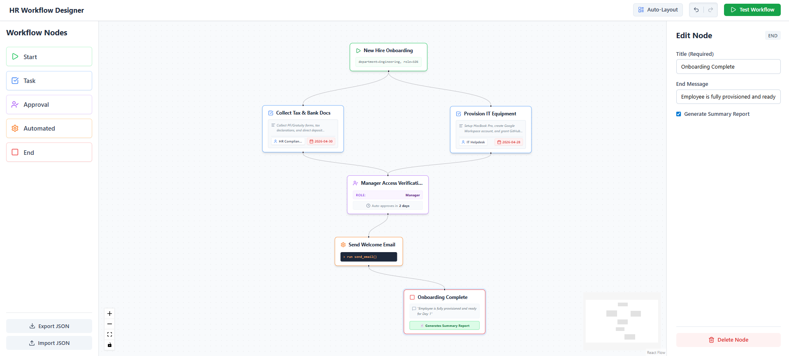
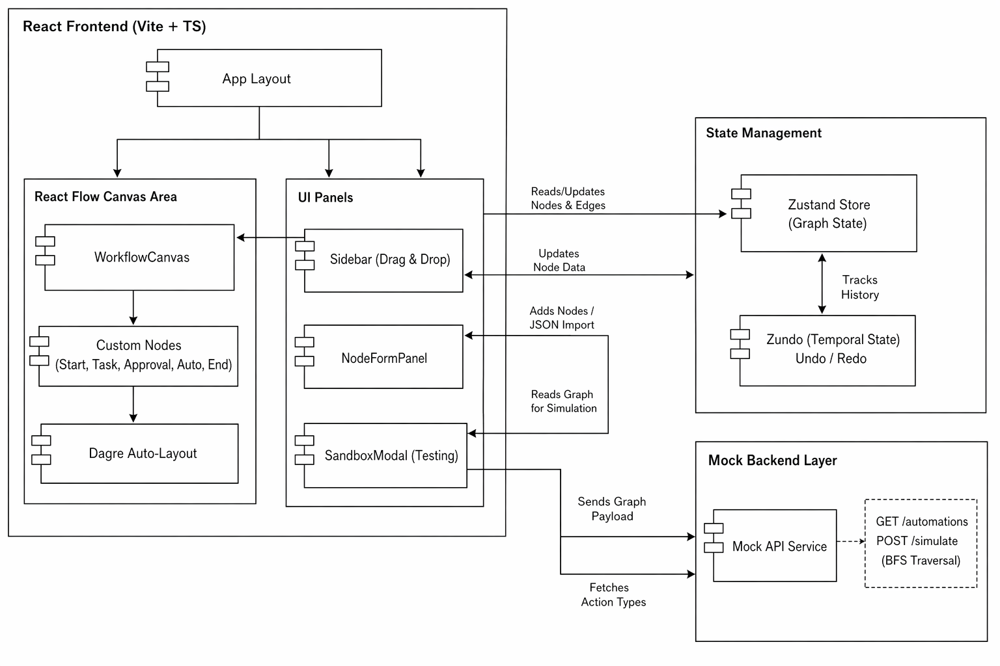

# HR Workflow Designer - Tredence Case Study

**Live Demo:** [Demo Link](https://tredence-hr-workflow-one.vercel.app/)



## Objective
A functional prototype of a mini-HR Workflow Designer module. This application allows HR admins to visually create, configure, and simulate internal workflows such as onboarding, leave approval, or document verification.

## What I Completed (Features)

Beyond the core requirements, I implemented several advanced features to ensure a highly robust and user-friendly experience:

* **Interactive Canvas:** Built with React Flow, supporting drag-and-drop from a custom sidebar, edge connections, and smooth zoom/pan controls.
* **Supercharged Custom Nodes:** Implemented 5 distinct node types (Start, Task, Approval, Automated Step, End) with custom SVG icons. Nodes feature mini-card layouts surfacing key attributes (like Assignees and Due Dates) directly on the canvas.
* **Dynamic Configuration Panels:** A context-aware properties panel that dynamically updates its fields based on the currently selected node type using controlled components.
* **Real-time Visual Validation:** Nodes dynamically render red error states and warning badges if they are missing required incoming or outgoing connections.
* **Execution Sandbox & Parallel Processing:** A simulation engine that serializes the graph, detects structural errors (missing starts, infinite cycles), and utilizes a **Breadth-First Search (BFS)** algorithm to simulate parallel execution paths.
* **Auto-Layout:** Integrated `dagre` to automatically calculate and mathematically organize messy spaghetti-graphs into clean, top-to-bottom hierarchies.
* **Undo/Redo History:** Implemented a temporal state wrapper allowing users to revert accidental deletions or layout changes.
* **JSON Export/Import:** Allows admins to serialize, download, and upload workflow configurations instantly.

## Architecture & Tech Stack



* **Framework:** React + Vite + TypeScript. (TypeScript ensures strict interfaces for node data payloads and graph structures).
* **Graph Engine:** React Flow.
* **State Management:** Zustand + Zundo. Chosen over Redux/Context for its minimal boilerplate and superior performance. `zundo` was integrated to handle complex history tracking (undo/redo) without manually managing state stacks.
* **Graph Math:** Dagre (for directed acyclic graph auto-layout).
* **Styling:** Tailwind CSS + Lucide React for clean, utility-first design matching modern analytical UI patterns.

## Design Decisions & Assumptions

1. **Local Mock API:** Instead of setting up a separate JSON server which complicates deployment, I engineered a robust local mock service utilizing JavaScript `Promises` and `setTimeout`. This perfectly mimics network latency while allowing the application to remain a static SPA, ensuring a frictionless live demo deployment on Vercel.
2. **Breadth-First Simulation Traversal:** To support branching logic (e.g., a Start node triggering a Task and an Automated Action simultaneously), the mock `/simulate` API uses a BFS queue system. It incorporates cycle detection (visited sets) and boundary checks to prevent infinite loops.
3. **Form Handling:** I utilized controlled components tied directly to the Zustand store. The configuration panel safely updates a node's internal data object `onChange` without causing unnecessary canvas re-renders, ensuring optimal performance.

## What I Would Add With More Time

While the core functionality and most bonus features are complete, scaling this for enterprise production would require:

* **Backend Persistence:** Transitioning the local mock API to a real backend using Node.js, Express, and PostgreSQL to save, version, and retrieve complex workflow definitions persistently.
* **Node Templates & Version History:** Allowing HR admins to save specific node configurations as reusable templates, and tracking audit logs of who changed which workflow version.
* **Authentication & RBAC:** Securing the designer behind an admin login (e.g., using JWTs or OAuth) and restricting certain node deployments or approval thresholds based on strict user roles.
* **Complex Node Types:** Adding conditional "Gateway" nodes (If/Else logic) that route workflows down different paths based on external data payloads.

## How to Run Locally

1. Clone the repository:
   ```bash
   git clone https://github.com/ritam03/tredence-hr-workflow.git
   ```

2. Navigate to the project directory:
   ```bash
   cd tredence-hr-workflow
   ```

3. Install dependencies:
   ```bash
   npm install
   ```

4. Start the development server:
   ```bash
   npm run dev
   ```